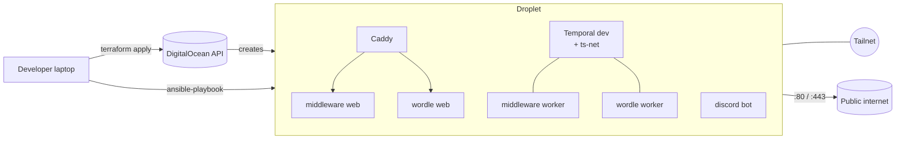

# infrastructure

PyTexas Foundation infrastructure provisioning & maintenance code.

Terraform stands up one DigitalOcean droplet behind a cloud firewall; Ansible hardens it,
installs Docker, joins the tailnet, and clones the service repos that run on it.

## Repo layout

```
infrastructure/
├── terraform/          # droplet, firewall, project, Spaces bucket holding tfstate, scoped key
├── ansible/            # bootstrap → docker → tailscale → services
│   └── roles/
├── compose/            # master docker-compose.yml (Temporal-ts-net + Caddy substrate)
├── secrets/            # sops-encrypted .env / .yaml files (decrypted on operator laptop)
├── .sops.yaml          # sops creation rules (age recipient list)
└── justfile            # tf-* / ansible-* / sops-* / bringup
```

Single state file: everything terraform-manages lives in `terraform.tfstate`, which is
stored in a DO Spaces bucket that terraform itself created. See
`terraform/README.md` for the bootstrap procedure.

## Architecture



The DigitalOcean cloud firewall is the only thing the public internet talks to: 22 (SSH,
narrow-able after tailscale is up), 80/443 (Caddy), 41641/UDP (Tailscale NAT traversal),
ICMP. Everything else binds to the tailscale or loopback interface.

## Prereqs

- [Terraform](https://developer.hashicorp.com/terraform/install) >= 1.6
- [Ansible](https://docs.ansible.com/ansible/latest/installation_guide/) >= 2.16
- [just](https://github.com/casey/just) (optional but every command below uses it)
- [sops](https://github.com/getsops/sops) >= 3.10 and [age](https://github.com/FiloSottile/age) >= 1.1 for secrets
- A DigitalOcean API token: <https://cloud.digitalocean.com/account/api/tokens>
- An SSH key already uploaded to your DO account
- A Tailscale auth key: <https://login.tailscale.com/admin/settings/keys>
- An age keypair at `~/.config/sops/age/keys.txt` (see `secrets/README.md` for setup
  and recovery procedure)

## Quickstart

The very first run needs the **bootstrap dance** because the Spaces bucket holding
terraform state doesn't exist until terraform itself creates it. After that, day-2 is
boring: `just tf-apply` / `just ansible-run`.

```bash
# One-time setup
cp terraform/terraform.tfvars.example terraform/terraform.tfvars
$EDITOR terraform/terraform.tfvars   # all values have defaults; edit only if you want overrides

# Generate your age keypair if you haven't (see secrets/README.md for full setup)
age-keygen -o ~/.config/sops/age/keys.txt && chmod 600 ~/.config/sops/age/keys.txt

# Populate the sops file ansible needs before the first run
sops secrets/ansible.sops.yaml   # tailscale_auth_key: tskey-auth-...

# Two kinds of DO credentials, needed for first apply only:
#   - DO API token from https://cloud.digitalocean.com/account/api/tokens
#   - Spaces access key from https://cloud.digitalocean.com/spaces/access_keys
export TF_VAR_do_token=dop_v1_xxxxxxxxxxxx
export SPACES_ACCESS_KEY_ID=DO00...
export SPACES_SECRET_ACCESS_KEY=...

just ansible-deps

# === First-time bootstrap (run once) ===
just tf-init-bootstrap         # 1. init with local state (backend.tf.disabled is hidden from terraform)
just tf-apply                  # 2. creates droplet + firewall + project + bucket
sops secrets/terraform.sops.env # 3a. put TF_VAR_do_token + AWS_ACCESS_KEY_ID + AWS_SECRET_ACCESS_KEY here
just tf-enable-backend          # 3b. renames backend.tf.disabled -> backend.tf
just tf-init-migrate            # 4. migrates local state into the bucket

# === Day-2 ===
just bringup                   # tf-apply + ansible inventory + playbook (idempotent)
```

`just bringup` runs `terraform apply`, generates a local ansible inventory from the
droplet IP, and then runs the full playbook. Re-running it is idempotent.

## Day-2 operations

| Want to...                         | Run                                              |
|------------------------------------|--------------------------------------------------|
| Re-run the playbook                | `just ansible-run`                               |
| Re-run just one role               | `just ansible-tag docker`                        |
| Re-push only secrets               | `just ansible-tag secrets`                       |
| Edit an encrypted secrets file     | `just sops-edit secrets/pytexas.sops.env`        |
| Verify all secrets decrypt cleanly | `just sops-check`                                |
| Re-encrypt after adding an operator| `just sops-rekey`                                |
| Dry-run config changes             | `just ansible-check`                             |
| See terraform plan                 | `just tf-plan`                                   |
| Lint everything                    | `just lint`                                      |
| Tear it all down (destructive)     | `just tf-destroy`                                |

## Secrets

Two flavors of secret in this repo:

**Bootstrap secrets** -- only needed for the very first apply, before
`secrets/terraform.sops.env` exists:

- `TF_VAR_do_token` -- DO API bearer token. Generate at
  <https://cloud.digitalocean.com/account/api/tokens>. After bootstrap, this lives
  encrypted in `secrets/terraform.sops.env`.
- `SPACES_ACCESS_KEY_ID` + `SPACES_SECRET_ACCESS_KEY` -- S3-protocol credentials for
  Spaces bucket creation. Generate at
  <https://cloud.digitalocean.com/spaces/access_keys>. After bootstrap, terraform
  creates a scoped replacement that lives encrypted in `secrets/terraform.sops.env`.
- `terraform/terraform.tfvars` is gitignored. Only `terraform.tfvars.example` is committed.
- `ansible/inventory.local.yml` is gitignored. Generate it with `just ansible-inventory`.

**Ansible-time secrets** -- sops-encrypted YAML, loaded into play scope on the controller:

- `secrets/ansible.sops.yaml` holds things ansible itself needs at deploy time (e.g. the
  host's Tailscale auth key for joining the droplet to the tailnet). `community.sops.load_vars`
  reads it during `pre_tasks` before any role runs.
- `TAILSCALE_AUTH_KEY` env var is still honored as a fallback for first-time bootstrap.

**Application secrets** that end up as `.env` files inside the containers -- `sops` +
`age`, encrypted in-repo:

- Encrypted dotenv files live under `secrets/*.sops.env`. They are safe to commit.
- Decryption happens on **your laptop**, not on the droplet. The plaintext crosses the
  wire over SSH and lands as `.env` files at `0600` next to each compose file.
- Edit with `just sops-edit secrets/pytexas.sops.env`. Sanity-check with `just sops-check`.
- New operator onboarding, key rotation, and full variable reference: `secrets/README.md`.

## What's intentionally not here yet

- DNS records (need finalized hostnames first)
- Terraform state locking (DO Spaces doesn't support it; acceptable at our scale).

The ansible playbook runs `docker compose up` for the substrate + every service at the
end of every run. Skip it with `ansible-playbook ... --skip-tags compose-up` if you want
to update config files without restarting containers.
