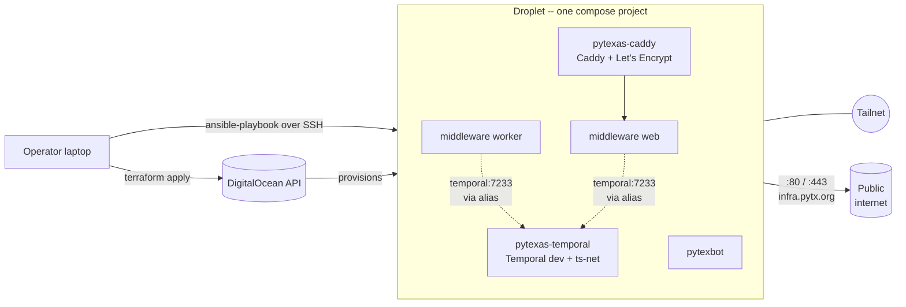
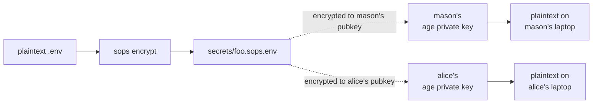

# infrastructure

PyTexas Foundation infrastructure-as-code. Stands up one DigitalOcean droplet in
`sfo3`, hardened by ansible, hosting a unified docker compose project that includes
the [`pretix-discord-middleware`](https://github.com/pytexas/pretix-discord-middleware)
and [`pytexas-discord-bot`](https://github.com/pytexas/pytexas-discord-bot) service
repos as sub-clones.

## Architecture



The DigitalOcean cloud firewall is the only thing the public internet talks to:
`22/tcp` (SSH), `80,443/tcp` (Caddy), `41641/udp` (Tailscale NAT traversal), ICMP.
The master Temporal joins the tailnet directly via `temporal-ts-net` so workers on
your laptop can reach it without exposing it to the public internet.

## The two operational contexts

Two justfiles, two purposes:

| Where | What | Run from |
|---|---|---|
| **`bootstrap/justfile`** | Provisioning (terraform, ansible, sops editing) | Your laptop |
| **Root `justfile`** | Service control (start/stop/restart/logs/pull) | The droplet, after SSH |

The root justfile is also deployed to `/srv/pytexas/justfile` (the droplet's checkout
of this repo), so `ssh pytexas@infra.pytx.org && cd /srv/pytexas && just up bot`
works in-place. Bootstrap is rare; maintenance is daily.

## Repo layout

```
infrastructure/
├── justfile                      # maintenance recipes (run on droplet)
├── bootstrap/justfile            # laptop-side recipes (terraform + ansible + sops)
├── docker-compose.yml            # master compose, `include:`s the service repos
├── Caddyfile                     # reverse-proxy config
├── temporal.Dockerfile           # Temporal image with temporal-ts-net baked in
├── terraform/                    # droplet, firewall, project, DNS, Spaces bucket (state)
├── ansible/                      # bootstrap → docker → tailscale → services
├── secrets/                      # sops-encrypted .env / .yaml files
├── .sops.yaml                    # sops creation rules (age recipient list)
└── .ai-sessions/                 # session summaries + lessons learned (BPE)
```

## Prerequisites

Install on your laptop:

- [Terraform](https://developer.hashicorp.com/terraform/install) >= 1.6
- [Ansible](https://docs.ansible.com/ansible/latest/installation_guide/) >= 2.16
- [just](https://github.com/casey/just) — recipe runner; every command below uses it
- [sops](https://github.com/getsops/sops) >= 3.10 and [age](https://github.com/FiloSottile/age) >= 1.1 for secrets

DigitalOcean and Tailscale setup:

- A DO API token: <https://cloud.digitalocean.com/account/api/tokens>
- A Spaces access key (separate page!): <https://cloud.digitalocean.com/spaces/access_keys>
- Your laptop's SSH key uploaded to DO
- A Tailscale account with an auth key:
  <https://login.tailscale.com/admin/settings/keys>. Recommended:
  Reusable=ON, Ephemeral=OFF, Pre-approved=ON, Tags=`tag:pytexas`.

## Secrets management with sops + age

All application and infrastructure secrets live encrypted in `secrets/` using
[`sops`](https://github.com/getsops/sops) with [`age`](https://github.com/FiloSottile/age)
recipient encryption. The encrypted ciphertext is safe to commit; the plaintext
only exists in `$EDITOR` while you're editing or in transit during a `just apply`.

### Recipient model

`.sops.yaml` lists one age **public** key per authorized operator. When sops
encrypts a file, every recipient gets their own encrypted copy of the data key,
so any one of them can decrypt independently. Onboarding a new operator =
adding their public key to `.sops.yaml` + running `just rekey`. No shared
password to rotate, no centralized vault.



### First-time setup (every new operator does this once)

```bash
# 1. Install sops + age on your laptop
# Ubuntu 24.04:
sudo apt install -y age
curl -fsSL https://github.com/getsops/sops/releases/latest/download/sops-v3.13.1.linux.amd64 \
    -o /tmp/sops
sudo install -m 0755 /tmp/sops /usr/local/bin/sops
rm /tmp/sops
# macOS:
brew install age sops

# 2. Generate your age keypair
mkdir -p ~/.config/sops/age
age-keygen -o ~/.config/sops/age/keys.txt
chmod 600 ~/.config/sops/age/keys.txt

# 3. Print your public key — share this with an existing operator
grep '^# public key:' ~/.config/sops/age/keys.txt

# 4. Back up the ENTIRE keys.txt to 1Password as a Secure Note titled
#    "sops age key — <your name> <hostname>". This is your only recovery if
#    your laptop dies.
```

### Joining an existing deployment

If a deployment already exists and you're the new operator:

1. Send your `age1...` public key (just the line `# public key:` prints) to an existing
   operator via PR against `.sops.yaml` or a secure channel — the public key itself
   isn't sensitive.
2. They add it under the `age:` recipient list in `.sops.yaml` and run
   `just rekey` to re-encrypt every secrets file with both recipients.
3. After they commit and push, `git pull` and verify you can decrypt:
   ```bash
   cd bootstrap
   just sops secrets/pytexas.sops.env   # should open the file in $EDITOR
   ```

### Bootstrapping a fresh deployment (no existing operator)

If you're the first operator and there's no encrypted state yet:

```bash
# 1. From the repo root, populate the secrets files. Each one opens
#    in $EDITOR; save and sops auto-encrypts on close.
cd bootstrap

just sops secrets/ansible.sops.yaml
# Paste:
#   tailscale_auth_key: tskey-auth-...

just sops secrets/pytexas.sops.env
# Paste:
#   TS_HOSTNAME=pytexas-temporal
#   TS_AUTHKEY=tskey-auth-...        # same value as above
#   MIDDLEWARE_DOMAIN=infra.pytx.org

just sops secrets/pretix-discord-middleware.sops.env
# Paste:
#   DISCORD_WEBHOOK_URL=https://discord.com/api/webhooks/...
#   PRETIX_API_TOKEN=...
#   TEMPORAL_ADDRESS=temporal:7233

just sops secrets/pytexas-discord-bot.sops.env
# Paste:
#   DISCORD_TOKEN=...
#   DISCORD_GUILD=PyTexas
#   PRETIX_API_TOKEN=...              # can be same as middleware

# secrets/terraform.sops.env is populated *after* the first apply, see Bootstrap below.
```

See `secrets/README.md` for the full variable reference, key rotation procedure,
operator removal, and lost-laptop recovery.

## First-time bootstrap

Run **once** to provision the DigitalOcean droplet and everything else from scratch.
All commands below run from `bootstrap/`.

```bash
cd bootstrap

# Install ansible collections (one-time, after git clone)
just setup

# Bootstrap credentials -- only needed for the first apply, before
# secrets/terraform.sops.env exists. Get the Spaces key at
# https://cloud.digitalocean.com/spaces/access_keys (separate page from API tokens).
export TF_VAR_do_token=dop_v1_xxxxxxxxxxxx
export SPACES_ACCESS_KEY_ID=DO00...
export SPACES_SECRET_ACCESS_KEY=...

# 1. Initial terraform init (backend.tf is named backend.tf.disabled so it's invisible)
cd ../terraform && terraform init && cd ../bootstrap

# 2. First apply -- creates droplet + firewall + project + Spaces bucket + DNS records.
#    State is local at this point.
just apply

# 3. Populate secrets/terraform.sops.env with the same three values you exported above
just sops secrets/terraform.sops.env
# Paste:
#   TF_VAR_do_token=dop_v1_...
#   SPACES_ACCESS_KEY_ID=DO00...
#   SPACES_SECRET_ACCESS_KEY=...
#   AWS_ACCESS_KEY_ID=DO00...           # same value as SPACES_ACCESS_KEY_ID
#   AWS_SECRET_ACCESS_KEY=...           # same value as SPACES_SECRET_ACCESS_KEY

# 4. Enable the remote backend
mv ../terraform/backend.tf.disabled ../terraform/backend.tf

# 5. Migrate local state into the Spaces bucket
cd ../terraform && \
    sops exec-env ../secrets/terraform.sops.env 'terraform init -migrate-state' && \
    cd ../bootstrap

# 6. Day-2 deploy (terraform reconciles, ansible runs)
just apply
```

After step 5, the local `terraform.tfstate` becomes obsolete. The remote state in
Spaces is canonical. Commit `terraform/backend.tf` (now enabled) and
`secrets/terraform.sops.env` (now populated).

Full bootstrap rationale and the destroy-ordering caveat live in `terraform/README.md`.

## Day-2 operations

### From your laptop (`bootstrap/`)

```bash
just apply                 # terraform reconcile + ansible playbook (idempotent)
just plan                  # preview terraform changes
just destroy               # tear everything down (read terraform/README.md first)
just ip                    # print the droplet's public IPv4
just sops <file>           # edit/create an encrypted secret
just rekey                 # re-encrypt every secrets file after adding/removing a recipient
just lint                  # terraform fmt + validate
```

`just apply` does the full pipeline: terraform apply, render the ansible inventory
from the terraform output, run the ansible playbook (which clones service repos,
pushes decrypted `.env` files, and brings up the compose stack).

### From the droplet (`/srv/pytexas/`)

```bash
ssh pytexas@infra.pytx.org
cd /srv/pytexas

just up      <all | bot | middleware | temporal>
just down    <all | bot | middleware | temporal>    # 'all' removes containers; specific target stops only
just restart <all | bot | middleware | temporal>
just logs    <bot | middleware | temporal>          # no 'all' -- too much noise
just pull    <all | bot | middleware | infra>      # git pull + rebuild + restart
```

All `just <verb>` calls without a target print the unified help block.

`just pull infra` updates this repo on the droplet itself; useful for quick
config tweaks without going back to your laptop and running `just apply`.

## Secrets architecture summary

Three categories of secrets, two storage mechanisms:

| Category | Stored as | Consumed by | Decrypts to |
|---|---|---|---|
| Bootstrap creds (first apply only) | Shell env vars | terraform, ansible | -- never on disk -- |
| Operator-side (terraform / ansible) | `secrets/terraform.sops.env`, `secrets/ansible.sops.yaml` | `sops exec-env`, `community.sops.load_vars` | Operator laptop memory only |
| Application secrets | `secrets/pytexas.sops.env`, `secrets/pretix-discord-middleware.sops.env`, `secrets/pytexas-discord-bot.sops.env` | docker compose `env_file:` | `.env` files on the droplet at `mode 0600` |

Decryption always happens on the operator's laptop via their age private key.
The droplet never holds a decryption key; it only receives plaintext `.env`
files pushed via the existing SSH connection during `just apply`.

For the full multi-operator workflow, key rotation, and recovery procedures see
**`secrets/README.md`**.

### Secret-leak protection

A `.pre-commit-config.yaml` runs [gitleaks](https://github.com/gitleaks/gitleaks) on
every commit to catch accidental plaintext secrets before they land in history — the
one real risk of a public infra repo. The sops-encrypted files are allowlisted in
`.gitleaks.toml` (their `ENC[...]` / age blocks aren't leaks). Install once:

```bash
pip install pre-commit    # or: brew install pre-commit / apt install pre-commit
pre-commit install        # from the repo root
```

If you make the repo public, also enable GitHub's native **Secret scanning** +
**Push protection** in repo settings — free for public repos and catches the same
vector server-side.

## Subsystem documentation

- **`terraform/README.md`** — bootstrap dance details, what each terraform resource
  does, destroy ordering caveat, what the firewall opens.
- **`ansible/README.md`** — role order, inventory generation, how the playbook is
  run.
- **`secrets/README.md`** — operator onboarding, key rotation, lost-laptop recovery,
  per-file variable reference.
- **`CLAUDE.md`** — guidance for Claude Code instances working in this repo.
- **`.ai-sessions/lessons.md`** — accumulated specific, actionable lessons from past
  sessions (gotchas the repo has already paid for).

## What's intentionally not (yet) automated

- **Terraform state locking** — DigitalOcean Spaces doesn't support it; acceptable
  at our scale (single operator, infrequent applies).
- **CI/CD pipelines** — apply is run manually from an operator's laptop.
- **`pull infra` over a private repo** — requires the infra repo be cloneable on
  the droplet. Either make the repo public (the only contents are sops-encrypted
  secrets and infra-as-code; no plaintext sensitive material) or configure a
  deploy key for the `pytexas` user on the droplet.
